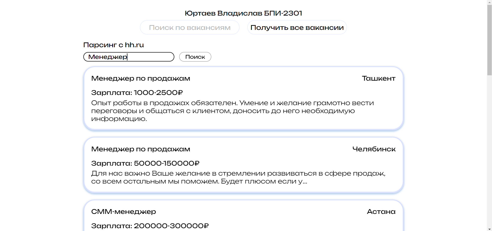
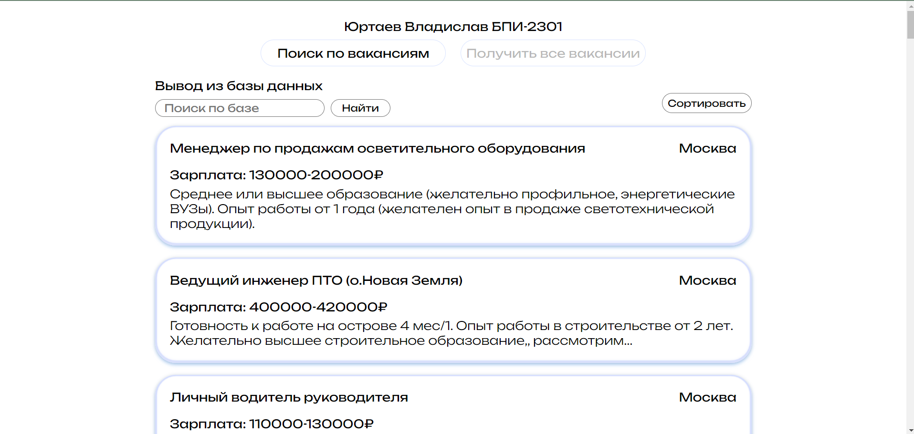
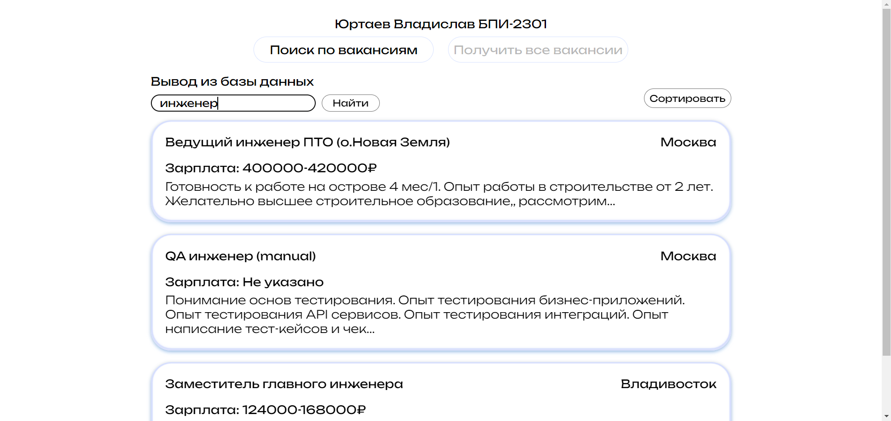

# МТУСИ практика
### Юртаев Владислав БПИ-2301

## 1. Предпромотр

### [----> Видео обзор <----](https://disk.yandex.ru/i/dOGR2jY8Op1_cw)

## 2. Установка

Перейдите в папку `./Practice` командой 

`cd .\Practice\`

Запустите `docker` образ командой  

`docker-compose up -d`

## 2.1 Ручная установка

### Backend:
    cd .\Practice\backend\  
    
    yarn

Запуск: `yarn run start:dev`  
### Frontend: 
    cd .\Practice\frontend\

    yarn 
    
Запуск: `yarn start`  
